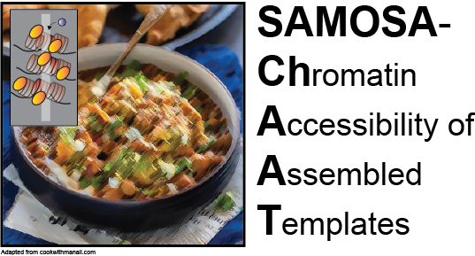

Studying chromatin remodeling at single-fiber resolution using SAMOSA-ChAAT
=====================
<p align="center">
  
</p>

The following README documents code & analyses performed in (and are largely reproduced from the methods section therein):

Abdulhay NJ\*, Hsieh LJ\*, McNally CP\*, Ketavarapu M, Kasinathan S, Nanda AS, Ostrowski MS, Wu K, Moore CM, Goodarzi H, Narlikar GJ#, Ramani V#. "Single-fiber nucleosome density shapes the regulatory output of a mammalian chromatin remodeling enzyme." *submitted* (2021)

*All scripts and binaries are provided as is, without any warranty and for use at your own risk. This is not the release of a software package. We are only providing this information and code in addition to a description of methods for making it easier to reproduce our analyses. We are __not__ providing any support for these scripts.*


SMRT data processing
--------------------
We applied our method to two use cases in the paper, and they differ in the computational workflow to analyze them. The first is for sequencing samples where every DNA molecule has the same sequence, which is the case for our remodeling experiments on the S1 and S2 sequences, presented in Figures 1-5. The second use case is for samples from cells containing varied sequences of DNA molecules, such as the murine in vivo follow up experiments presented in Figures 6-7. The first will be referred to as homogeneous samples, and the second as genomic samples. The workflow for homogenous samples will be presented first in each section, and the deviations for genomic samples detailed at the end.

*Sequencing read processing*

Sequencing reads were processed using software from Pacific Biosciences. The following describes the workflow for homogenous samples:
	Demultiplex reads
Reads were demultiplexed using lima. The flag `--same` was passed as libraries were generated with the same barcode on both ends. This produces a BAM file for the subreads of each sample.
	Generate Circular Consensus Sequences (CCS)
CCS were generated for each sample using ccs. Default parameters were used other than setting the number of threads with `-j`. This produces a BAM file of CCS.
	Align subreads to the reference genome
pbmm2, the pacbio wrapper for minimap2 (Li, 2018), was run on each subreads BAM file (the output of step 1) to align subreads to the reference sequence, producing a BAM file of aligned subreads.
	Generate missing indices
Our analysis code requires pacbio index files (.pbi) for each BAM file. `pbmm2` does not generate index files, so missing indices were generated using `pbindex`.
For genomic samples, replace step 3 with this alternate step 3
	Align CCS to the reference genome
Alignment was done using pbmm2, and run on each CCS file, resulting in BAM files containing the CCS and alignment information.

*Extracting IPD measurements*

The IPD values were accessed from the BAM files and log10 transformed after setting any IPD measurements of 0 frames to 1 frame. Then, for each ZMW, at each base in the CCS (for genomic samples) or amplicon reference (for homogenous samples), for both strands, the log transformed IPD values in all subreads were averaged. These mean log IPD values for the molecule were then exported along with the percentiles of log IPD values across subreads within that molecule.

*Predicting methylation status of individual adenines*

**Predicting methylation in homogenous samples**

For homogenous samples dimensionality reduction was used to capture variation in IPD measurements between molecules, and then the reduced representations and IPD measurements were used to predict methylation. For each of S1 and S2, the non-adenine mean log IPD measurements from one unmethylated control sample were used to train a truncated singular value decomposition model. The input measurements had the mean of each base subtracted before training. The Truncated SVD class of scikit-learn was used and trained in 20 iterations to produce 40 components. The trained model was then used to transform all molecules in all samples into their reduced representations. Each resulting component had its mean subtracted and was divided by its standard deviation.

Next, a neural network model was trained to predict the mean log IPD at each base in unmethylated control molecules. The dimension reduced representation of the molecules were provided as input to the model, and the output was a value for each adenine on both strands of the amplicon molecule. The neural network was composed of four dense layers with 600 units each, with relu activation and he uniform initialization. A 50% dropout layer was placed after each of these four layers. A final dense layer produced an output for each adenine in the amplicon reference. The model was trained on a negative control sample using Keras, Adam optimizer, mean square error loss, 100 epochs and a batch size of 128. The trained model was then used to predict the mean log IPD value at all adenines in all molecules in all samples. This prediction was subtracted from the measured mean log IPD to get residuals.

A large positive residual represents slower polymerase kinetics at that adenine than would be expected given the sequence context and molecule and is thus evidence of methylation. To find a cutoff of how large the residual should be to be called as methylated, we assembled a dataset of residuals from an equal proportion of molecules from a fully methylated naked DNA control and an unmethylated control. For each individual adenine a student’s t-distribution mixture model was fit to the residuals using the python package smm (Peel and McLachlan, 2000). A two-component model was fit with a tolerance of 1e-6, and a cutoff was found where that residual value was equally likely to originate from either of the two components. Adenines were then filtered by whether a sufficiently informative cutoff had been found. The three criteria for using the methylation predictions at that adenine in further analysis were: 1) The mean of at least one t-distribution had to be above zero, 2) The difference between the means of the two t-distributions had to be at least X, where X was chosen separately for each amplicon reference but varied from 0.1 to 0.3, and 3) At least 2% of the training data was over the cutoff. These were lenient cutoffs that allowed the methylation predictions at 90+% of adenines to be included in downstream analysis. This was done because the next HMM step accounts for the frequency of methylation predictions in unmethylated and fully methylated control samples, and thus adenine bases where methylation prediction was poor will be less informative of DNA accessibility.

**Predicting methylation in genomic samples**

Methylation prediction was made in a similar fashion for genomic samples, with deviations necessitated by the differences in the data. Unlike in homogenous samples, dimensionality reduction could not be used to capture inter-molecular variation due to varying DNA sequences. Instead IPD percentiles were used as neural network inputs. As described above in Extracting IPD measurements, log IPD percentiles were calculated across all subreads in each molecule separately for each template base. Every 10th percentile from 10th to 90th inclusive, for template bases C, G, and T, were used as neural network input. The other input was the DNA sequence context around the measured base, given for three bases 5’ of the template adenine and ten bases 3’ of the template adenine, one-hot encoded. The neural network was a regression model predicting the measured mean log IPD at that template adenine. The neural network consisted of four dense layers with 200 units each, relu activation, and he uniform initialization. The training data was 5,000,000 adenines each from six different unmethylated control samples. The validation data for early stopping was 5,000,000 adenines from each of two more unmethylated control samples. The model was trained using Keras, Adam optimizer, 20 epochs with early stopping (patience of 2 epochs), and a batch size of 128.

To determine at which adenines the methylation prediction was usefully informative and accurate, we used a second neural network model to predict the IPD residual in a positive control sample from sequence context. Sequence contexts that consistently produced residuals near zero in a positive control would be likely never methylated by EcoGII, or always methylated endogenously. The input to this network was the one-hot encoded sequence context as described above. The output was the measured log IPD with predicted log IPD subtracted. The training data was a fully methylated naked DNA sample of E14. Mean log IPD residuals were calculated using the above trained model. 20,000,000 adenines were used as training data and 10,000,000 as validation data. The neural network consisted of three dense layers of 100 units, relu activation, and he uniform initialization. The model was trained using Adam optimizer for two epochs with a batch size of 128. After examining the output of the trained model on negative and positive controls and chromatin, we settled on a cutoff of 0.6 for the predicted residual in positive control for calling a sequence context as usable for downstream analysis, and a cutoff of 0.42 for the mean log IPD residual for calling an adenine as methylated.

*Predicting molecule-wide DNA accessibility using Hidden Markov Models*

**Predicting DNA accessibility in homogeneous samples**

To go beyond individual methylation predictions and predict DNA accessibility along each molecule we applied a Hidden Markov Model (HMM). An HMM model was constructed for each amplicon reference, with two states for every adenine at which methylation was predicted: one state representing that adenine being inaccessible to the methyltransferase, and another representing it being accessible. The emission probabilities were all Bernoulli distributions, with the probability of observing a methylation in an inaccessible state being the fraction of unmethylated control molecules predicted to be methylated at that adenine, and the probability of observing a methylation in an accessible state being the fraction of fully methylated naked DNA control molecules predicted to be methylated at that adenine. 0.5 was added to the numerator and denominator of all fractions to avoid any probabilities of zero. An initial state was created with an equal probability of transitioning into either accessible or inaccessible states. Transition probabilities between adenines were set using the logic that for an expected average duration in a single state of L, by the geometric distribution at each base the probability of switching states at the next base will be 1/L. The probability of staying in the same state from one adenine to the next is thus 〖(1-1/L)〗^B, where B is the distance in bases between adenines. The probability of switching to the other state at the next adenine is then 1 minus that value. Different values of the average duration L were tested, and ultimately a value of 1000 bp was used. This is much higher than expected, but has the beneficial result of requiring a higher burden of evidence to motivate switching states and thus minimizes spurious switching.

With the HMM model constructed, the most likely state path was found using the Viterbi algorithm for all molecules in all samples, with the predicted methylation at each adenine provided as the input. The solved path was output as an array with accessible adenines as 1, inaccessible as 0, and non-adenine and uncalled bases interpolated.

**Predicting DNA accessibility in genomic samples**

In genomic samples DNA accessibility was predicted in a similar fashion to homogenous, except that the HMM model had to be individually constructed for each molecule due to varying DNA sequences, and rather than empirically measuring the fraction of methylation in positive and control samples at each position, neural networks were trained to predict the fraction of methylation in each from sequence context.

A neural network model was trained to predict the predicted methylation status of adenines in the positive control sample based on sequence context. The output from this model was used to approximate the probability of an adenine in that sequence context getting predicted as methylated if it was accessible to EcoGII. The sample used for training was the same naked DNA E14 methylated sample used to train the positive residual prediction model. Approximately 27,600,000 adenines were used as the training set and 7,000,000 as the validation set. The input was the one-hot encoded sequence context. The neural network consisted of three dense layers of 200 units, relu activation and he uniform initialization. The training output were binary methylation predictions, so the final output of the network had a sigmoid activation and binary cross-entropy was used as the loss. The model was trained with Adam optimizer for seven epochs with the batch size increasing each epoch from 256 to a max of 131,072.

An identical network was trained to predict the predicted methylation status of adenines in the unmethylated negative control samples. The output from this model was used to approximate the probability of an adenine in that sequence context getting predicted as methylated if it was not accessible to EcoGII. This one was trained using adenines combined from four different unmethylated samples, and approximately 28,100,000 adenines were used as the training set and 7,100,000 as the validation set.

The HMM models were constructed in an identical manner to that described above for homogenous samples, except for genomic data an HMM model was constructed for each sequenced molecule individually. States and transition probabilities and observed output were the same. The emission probability of observing methylation at each accessible state was the output of the trained positive control methylation prediction model, and for inaccessible states was the output of the trained negative control methylation prediction model. As with homogenous samples, the HMM was solved using the observed methylation and the Viterbi algorithm.

*Defining inaccessible regions and counting nucleosomes*

Inaccessible regions were defined from the HMM output data as continuous stretches with accessibility <= 0.5. To estimate the number of nucleosomes contained within each inaccessible region, a histogram of inaccessible region lengths was generated for each data type (sequence S1, S2, and murine in vivo). Periodic peaks in these histograms were observed that approximated expected sizes for stretches containing one, two, three, etc. nucleosomes. Cutoffs for the different categories were manually defined using the histogram, including a lower cutoff for sub-nucleosomal regions (Supplementary Figure 12).

Processed data analysis
------------------------
Most processed data analyses proceeded from data tables generated using custom python scripts. Resulting data tables were then used to compute all statistics reported in the paper and perform all visualizations (using tidyverse and ggplot2 in R; associated Jupyter notebook included here as `SNF2h_SAMOSA_Figures.ipynb`). Below, we describe each analysis in text form, while noting that all code is freely available at the above link.

*UMAP and Leiden clustering analyses*

All UMAP and Leiden clustering analyses were performed using the scanpy package (Wolf et al., 2018). All UMAP visualizations (McInnes et al., 2018) were made using default parameters in scanpy. Leiden clustering (Traag et al., 2019) was performed using resolution = 0.4; clusters were then filtered on the basis of size such that all clusters that collectively summed up to < 5% of the total dataset were removed. In practice, this served to remove long tails of very small clusters defined by the Leiden algorithm.

*Signal correlation analyses*

We converted footprint data files into a vector of footprint midpoint abundance for sequences S1 and S2 by summing footprint midpoint occurences and normalizing against the total number of footprints. We then correlated these vectors across replicate experiments using R for both correlation calculations and plotting associated scatterplots.

*Trinucleosome analyses*

Using processed footprint midpoint data files, we examined, for each footprinted fiber, the distances between all consecutive footprints sized between 100 and 200 bp, and plotted these distances against each other. All calculations were made on processed data tables generated using scripts described in the associated Jupyter notebook.

*Autocorrelation analyses*

Autocorrelations for in vitro and in vivo data were calculated using python, and then clustered as described above. All scripts for computing autocorrelation are available at the above link.

*CTCF motif analyses*

We examined the relative accessibility of 17 nucleotide windows tiling sequences S1 and S2 for each footprinted molecule before (native) and after (remodeled) remodeling, summarizing accessibility as a binary value thresholded on whether > 0.9 * the window length was accessible on a single molecule. We then stored these values in a data frame, and plotted the relative fractions of accessible windows against each other as log-odds values.

*In vivo chromatin fiber analyses*

All autocorrelation and clustering analyses were done as previously performed (Abdulhay et al., 2020). Autocorrelation and clustering were performed above. Nucleosome density enrichment plots were generated by estimating probability distributions for background (all molecules) and cluster-specific (clustered molecules) molecules, and computing log-odds from these distributions. All per-fiber nucleosome density measurements were calculated as above. Fisher’s Exact enrichment tests were carried out using scipy in Python as in Abudlhay et al (2020). All p-values calculated were then corrected using a Storey q-value correction, using the qvalue package in R (Storey and Tibshirani, 2003). Multiple hypothesis correction was performed for all domain-level Fisher’s tests (including ATAC peak analyses) and cutoffs were made at q < 0.05.

Molecules falling within ENCODE-defined epigenomic domains were extracted using scripts published in Abdulhay et al (2020).

*ATAC data reanalysis*

SNF2hKO and WT ATAC-seq data (Barisic et al., 2019) were downloaded, remapped to mm10 using bwa, converted to sorted, deduplicated BAM files, and then processed using macs2 to define accessibility peaks. Peaks were then filtered for reproducibility using the ENCODE IDR framework, and reproducible peaks were preserved for downstream analyses. Reproducible peaks for SNF2hKO and WT samples were pooled and merged using bedtools merge, and then used to generate count matrices using bedtools bamcoverage. Resulting count matrices for replicate experiments were then fed into DESeq2 to define statistically significant differentially accessible peaks with an adjusted p-value cutoff of 0.05.

*In vivo TF binding analyses*

Molecules containing previously-defined (Ramani et al., 2019) ENCODE-backed Ctcf bound motifs were extracted using scripts previously published (Abdulhay et al., 2020). Control molecules were obtained by randomly sampling a resource of Ctcf motif matches provided by Vierstra et al (2021). Single-molecule signals centered at the predicted motif center were stored as an array and clustered as above to obtain the clusters shown in the text. Enrichment analyses and associated multiple-hypothesis correction were performed as above for all enrichment tests performed for this array of Ctcf sites.

*Satellite sequence analyses*

Detecing mouse minor (centromeric) and major (pericentromeric) satellite is challenging because of the similarity of these two sequences (including internal / self-similarity). The latter is also an issue with the telomere repeat. To use BLAST to find matches to these sequences, the output must be processed to remove overlapping matches, which is done here heuristically using an implementation of the weighted interval scheduling dynamic programming algorithm that seeks to optimize the summed bitscores for non-overlapping matches to all three sequences (minor satellite, major satellite, and telomeres). This is not a perfect solution to the problem, in part because it treats the alignment for the three different repeats as effectively equivalent and we do not believe the alignments produced by BLAST are optimal compared to e.g. Smith-Waterman alignment, and the attendant fuzziness introduced may lead to removal of a small fraction of bona fide matches.

Given the similarity of major and minor satellite sequences in particular, using the DFAM minor (SYNREP_MM, accession DF0004122.1) and major (GSAT_MM, accession: DF0003028.1) satellite consensus sequences, which both exceed well-established monomer lengths of ~120 bp (minor) and ~234 bp (major), produces too many overlapping hits. Thus, we used more representative sequences from Genbank, specifically M32564.1 for major satellite, and X14462.1 for minor satellite. The telomere repeat sequence was constructed by pentamerizing the telomere repeat (i.e. [TTAGGG] x 5). All code used for these analyses is deposited at the above GitHub link.

**Usage of satellite sequence analysis scripts**

INPUT:
    - BAM file

OUTPUT:
    - blast_bed/*.raw.bed.gz     : BLAST output converted to BED format
    - blast_bed/*.pruned.bed.gz  : Overlapping matches removed
    - ./*.stats.txt.gz           : Per-read & per-read/per-repeat match statistics

    ** Format of output files is detailed below **

USAGE:
        Dependencies (assumed to be in path):
            - Python    3.7.6 (base packages are sufficient)
            - blast     2.9.0, build Sep 28 2019 00:38:34
            - samtools  1.9

    1.  Call bash script to create FASTA sequences for major and minor satellite
        repeats and concatemerized telomere repeat and then make a blast database
        containing these sequences. The FASTA files and blast database files are
        created in the working directory and placed in a folder called 'db'.

            ./make_blastdb.sh

        *   No files need to be provided to the shell script; everything needed
            is contained within the bash script, which also hard codes variables
            specifying directories, db name, etc.

    2.  Call bash script to run blastn to identify reads containing matches to
        database sequences and resolve overlaps; needs to be run in the same
        directory as where the 'db' folder was set up.

            ./blast_bam.sh  <path_to_BAM> <output_director>

        *   Maximum E-value is set to 1e-3 in blast_bam.sh

        *   Other parameters also hard-coded as variables in blast_bam.sh include
            directory paths for blast database, output files, etc.


Extracting ZMWs near predicted transcription factor binding sites
-----------------
We used `zmw_selector.py` to extract all aligned ZMWs where a portion of the alignment falls within 1000 bp of a predicted trancription factor binding site. The script takes 4 command line arguments,
a list of sites formatted as 'chrid \t site \t strand', a list valid chromosomes / chromosome sizes, an aligned, sorted, and indexed BAM file (the aligned CCS reads in this case), and an integer for the window size. The output is a tab-separated file containing the ZMW hole numbers, the alignment start, end, and strand, and the feature strand. zmw_selector.py is run as follows:

```python ../../zmw_selector.py ${flat} ${chrom_sizes} ${bam} 1000 > ${output}```
